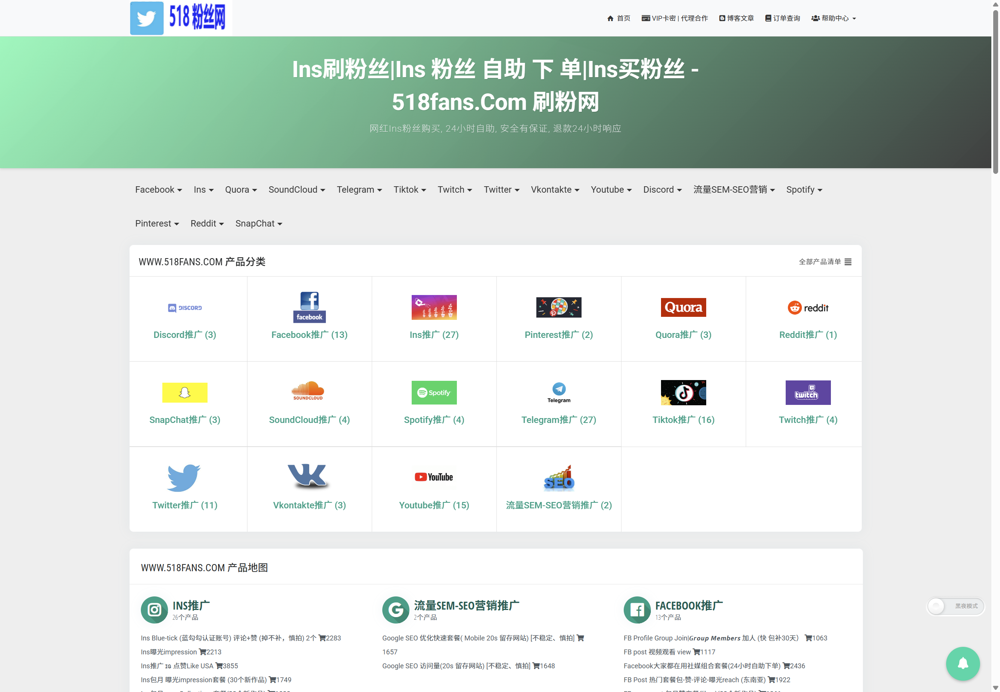

# HiHarmonyOS

基于 Astro 构建的静态内容站项目，当前站点定位为鸿蒙技术博客与个人内容展示站，适合部署到 GitHub + Vercel，并使用独立域名 `www.hiharmonyos.com` 对外发布。

这个仓库已经完成了博客首页、文章详情、分类页、标签页、归档页、RSS、站点地图、纸张风格 UI 以及 `.html` 结尾路由等基础能力，适合继续扩展为内容品牌站、专题站或博客官网。

## 项目简介

HiHarmonyOS 是一个偏内容驱动的静态网站项目，核心目标包括：

- 使用 Astro 搭建轻量、可维护、可长期更新的站点
- 以 Markdown 作为文章内容源，便于 Git 化管理
- 保持对 SEO 友好的页面结构，包括 `sitemap.xml`、`robots.txt` 与 RSS
- 采用偏复古纸张与杂志排版的视觉风格，提升内容阅读体验
- 支持分类、标签、归档、个人兴趣专区等扩展能力

## 518fans.com 网站介绍

`518fans.com` 是一个面向海外社交平台增长服务的综合型站点，主要围绕 Instagram、Facebook、Twitter、TikTok、Telegram、YouTube 等平台提供对应的数据增长与下单服务，并提供 24 小时自动处理订单、订单查询、帮助中心、博客文章、API 接口以及代理合作入口  <https://www.518fans.com/> 。

从站点结构和业务表达来看，`518fans.com` 具备以下特点：

- 首页信息密度高，分类入口明确，适合快速浏览和直接下单
- 覆盖多个海外社交平台，服务维度较多，便于形成商城式目录结构
- 支持订单查询、帮助中心、售后支持与 API，对接场景较完整
- 具备代理合作与分销能力，适合做流量服务、数据服务或资源聚合平台
- 页面风格偏商业化与服务导向，强调效率、类目和转化路径

如果把这个项目继续向业务站方向扩展，`518fans.com` 可以作为“高密度内容商城型首页”的参考案例；如果继续向博客和品牌展示方向迭代，则可以把它作为业务介绍、案例展示或关联站点说明来补充。

## 518fans.com 首页截图

下面这张截图已保存到仓库，可直接在 README 中预览：



截图文件路径：

- `docs/images/518fans-homepage.png`

## 当前功能

- 首页 Hero 区、精选文章区、技术分类区、个人兴趣区
- 博客列表页与文章详情页
- 分类总览页、分类详情页
- 标签总览页、标签详情页
- 中文归档页
- RSS 输出
- `robots.txt` 与 `sitemap.xml`
- 统一 `.html` 结尾页面规则（首页除外）
- 自定义 favicon 与基础 SEO head 配置

## 技术栈

- Astro 5
- TypeScript
- Markdown 内容集合
- Vercel 静态部署

## 项目结构

```text
.
├─ public/                  # 静态资源，例如 favicon
├─ docs/
│  └─ images/               # README 使用的截图资源
├─ src/
│  ├─ components/           # 通用组件
│  ├─ content/
│  │  ├─ config.ts          # 内容集合定义
│  │  └─ posts/             # Markdown 文章
│  ├─ layouts/              # 页面布局
│  ├─ lib/                  # URL、日期、分类等工具函数
│  ├─ pages/                # 页面与路由
│  └─ styles/               # 全局样式
├─ astro.config.mjs         # Astro 配置
├─ vercel.json              # Vercel 部署配置
└─ README.md
```

## 本地开发

安装依赖：

```bash
npm install
```

启动开发环境：

```bash
npm run dev
```

类型检查：

```bash
npm run check
```

构建静态产物：

```bash
npm run build
```

本地预览构建结果：

```bash
npm run preview
```

## 路由规则

当前站点已经切换为文件输出模式，URL 规则如下：

- 首页：`/`
- 博客首页：`/blog.html`
- 关于页：`/about.html`
- 归档页：`/blog/archive.html`
- 分类页：`/blog/categories.html`
- 标签页：`/blog/tags.html`
- 文章页：`/blog/xxx.html`
- 分类详情页：`/blog/category/xxx.html`
- 标签详情页：`/blog/tag/xxx.html`

## 相关外链

如果你想了解 `518fans.com` 的实际站点内容、页面结构和服务入口，可以直接访问以下链接：

- [518fans.com 官网首页](https://www.518fans.com/)
- [518fans.com 帮助中心](https://www.518fans.com/support)
- [518fans.com 博客文章](https://www.518fans.com/blog)
- [518fans.com API 接口页面](https://www.518fans.com/api)

这些链接采用普通 Markdown 外链写法，不额外添加 `nofollow` 参数，适合在 README 中作为正常引用与延伸阅读入口。
